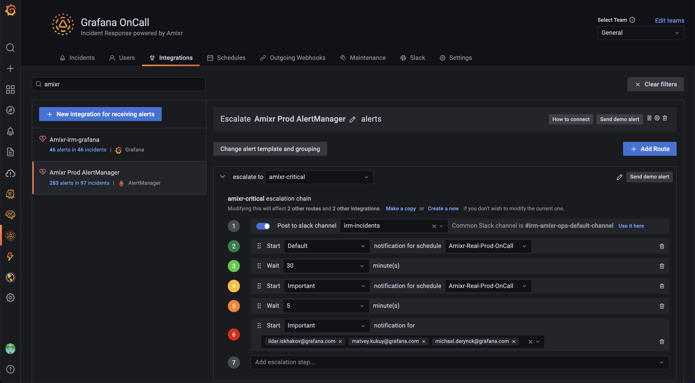
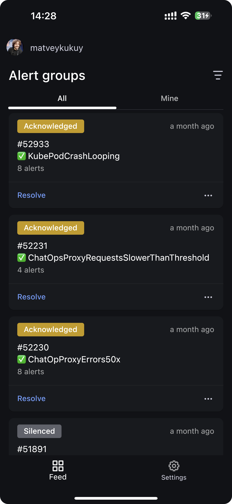

# Grafana OnCall


[](https://github.com/grafana/oncall/releases)
[](https://github.com/grafana/oncall/blob/dev/LICENSE)
[](https://hub.docker.com/r/grafana/oncall/tags)
[](https://slack.grafana.com/)
[](https://github.com/grafana/oncall/discussions)
[](https://drone.grafana.net/grafana/oncall)

Developer-friendly incident response with brilliant Slack integration.

<!-- markdownlint-disable MD013 MD033 -->
<table>
  <tbody>
    <tr>
    <td width="75%"></td>
      <td><div align="center"><a href="https://grafana.com/docs/oncall/latest/mobile-app/">Android & iOS</a>:<br></div></td>
    </tr>
  </tbody>
</table>
<!-- markdownlint-enable MD013 MD033 -->

- Collect and analyze alerts from multiple monitoring systems
- On-call rotations based on schedules
- Automatic escalations
- Phone calls, SMS, Slack, Telegram notifications

## Getting Started

We prepared multiple environments:

- [production](https://grafana.com/docs/oncall/latest/open-source/#production-environment)
- [developer](./dev/README.md)
- hobby (described in the following steps)

1. Download [`docker-compose.yml`](docker-compose.yml):

   ```bash
   curl -fsSL https://raw.githubusercontent.com/grafana/oncall/dev/docker-compose.yml -o docker-compose.yml
   ```

2. Set variables:

   ```bash
   echo "DOMAIN=http://localhost:8080
   # Remove 'with_grafana' below if you want to use existing grafana
   # Add 'with_prometheus' below to optionally enable a local prometheus for oncall metrics
   # e.g. COMPOSE_PROFILES=with_grafana,with_prometheus
   COMPOSE_PROFILES=with_grafana
   # to setup an auth token for prometheus exporter metrics:
   # PROMETHEUS_EXPORTER_SECRET=my_random_prometheus_secret
   # also, make sure to enable the /metrics endpoint:
   # FEATURE_PROMETHEUS_EXPORTER_ENABLED=True
   SECRET_KEY=my_random_secret_must_be_more_than_32_characters_long" > .env
   ```

3. (Optional) If you want to enable/setup the prometheus metrics exporter
(besides the changes above), create a `prometheus.yml` file (replacing
`my_random_prometheus_secret` accordingly), next to your `docker-compose.yml`:

   ```bash
   echo "global:
     scrape_interval:     15s
     evaluation_interval: 15s

   scrape_configs:
     - job_name: prometheus
       metrics_path: /metrics/
       authorization:
         credentials: my_random_prometheus_secret
       static_configs:
         - targets: [\"host.docker.internal:8080\"]" > prometheus.yml
   ```

   NOTE: you will need to setup a Prometheus datasource using `http://prometheus:9090`
   as the URL in the Grafana UI.

4. Launch services:

   ```bash
   docker-compose pull && docker-compose up -d
   ```

5. Go to [OnCall Plugin Configuration](http://localhost:3000/plugins/grafana-oncall-app), using log in credentials
   as defined above: `admin`/`admin` (or find OnCall plugin in configuration->plugins) and connect OnCall _plugin_
   with OnCall _backend_:

   ```text
   OnCall backend URL: http://engine:8080
   ```

6. Enjoy! Check our [OSS docs](https://grafana.com/docs/oncall/latest/open-source/) if you want to set up
   Slack, Telegram, Twilio or SMS/calls through Grafana Cloud.

## Update version

To update your Grafana OnCall hobby environment:

```shell
# Update Docker image
docker-compose pull engine

# Re-deploy
docker-compose up -d
```

After updating the engine, you'll also need to click the "Update" button on the [plugin version page](http://localhost:3000/plugins/grafana-oncall-app?page=version-history).
See [Grafana docs](https://grafana.com/docs/grafana/latest/administration/plugin-management/#update-a-plugin) for more
info on updating Grafana plugins.

## Join community

[](https://github.com/grafana/oncall/discussions/categories/community-calls)
[](https://github.com/grafana/oncall/discussions)
[](https://slack.grafana.com/)

## Stargazers over time

[](https://starchart.cc/grafana/oncall)

## Further Reading

- _Migration from PagerDuty_ - [Migrator](https://github.com/grafana/oncall/tree/dev/tools/pagerduty-migrator)
- _Documentation_ - [Grafana OnCall](https://grafana.com/docs/oncall/latest/)
- _Overview Webinar_ - [YouTube](https://www.youtube.com/watch?v=7uSe1pulgs8)
- _How To Add Integration_ - [How to Add Integration](https://github.com/grafana/oncall/tree/dev/engine/config_integrations/README.md)
- _Blog Post_ - [Announcing Grafana OnCall, the easiest way to do on-call management](https://grafana.com/blog/2021/11/09/announcing-grafana-oncall/)
- _Presentation_ - [Deep dive into the Grafana, Prometheus, and Alertmanager stack for alerting and on-call management](https://grafana.com/go/observabilitycon/2021/alerting/?pg=blog)
